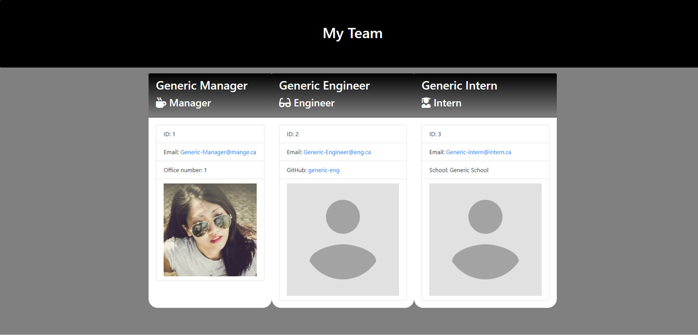

# Employee Template CLI

## Table of Contents
> - [Description](#Description)
> - [Keywords](#Keywords)
> - [Contributors](#Contributors)
> - [Usage](#Usage)
> - [Installation](#Installation)
> - [Test](#Testing)
> - [License](#License)
> - [Deployment](#Deployment)
> - [Questions](#Questions)

## Description
>Command Line Interface to Organize Small Company Employee Directory

## Keywords
>*NodeJS, CLI, Inquirer, Template, Jest*

## Contributors
>Liam Mackinnon

## Usage 
>node index.js

## Installation
>*npm i*

## Testing
>Jest

## License
>MIT

## Deployment
Live Recording?: https://drive.google.com/file/d/1jJtUYwaO4NYXIUU8bWS6ayu6rEgQyceK/view

Screenshot?: Yes

### Questions
>If you have any further questions about the application:
>Email: lmackinnon.inbox@gmail.com
>
>GitHub: www.github.com/liam-mack
